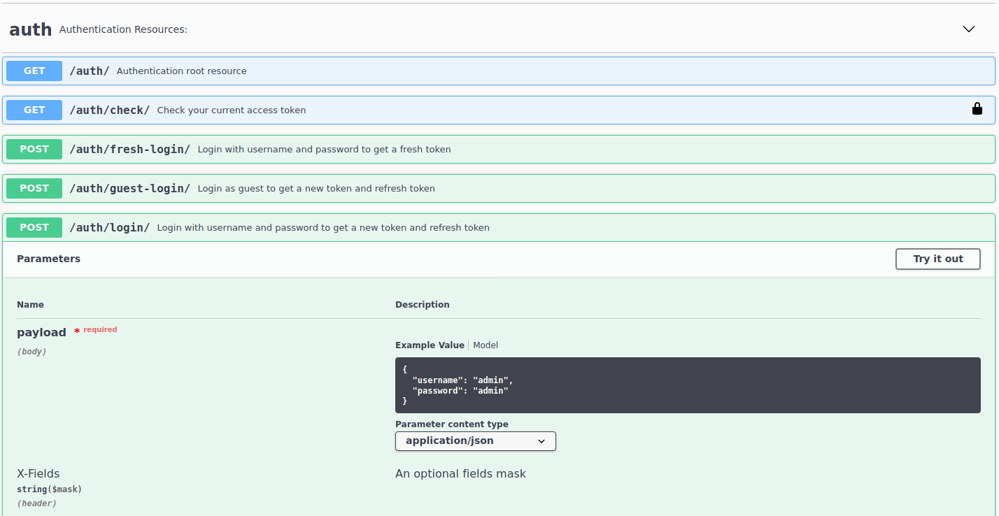
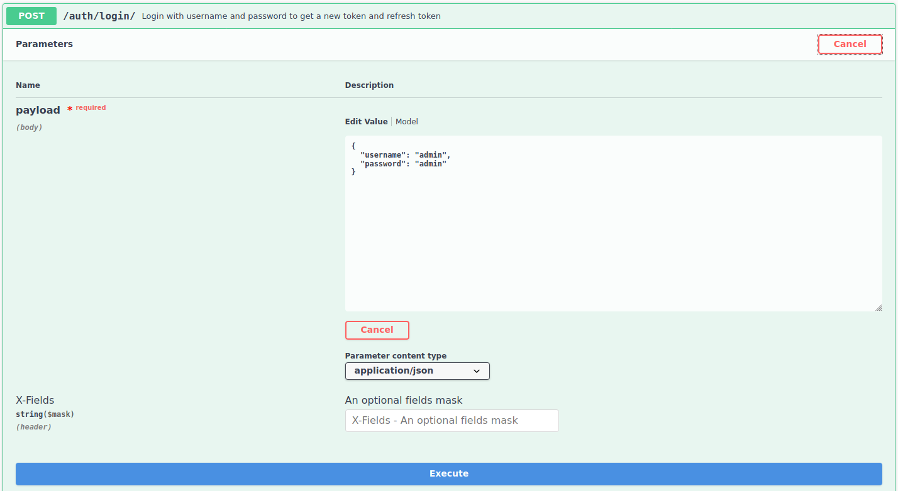
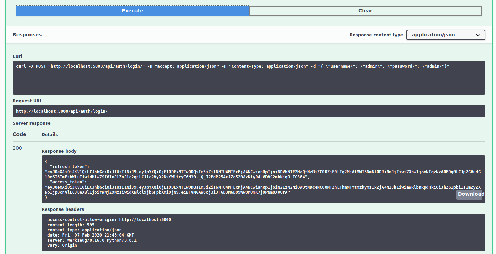
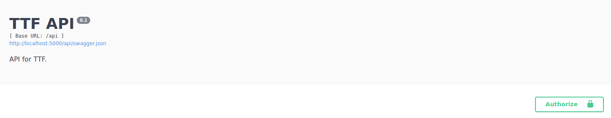
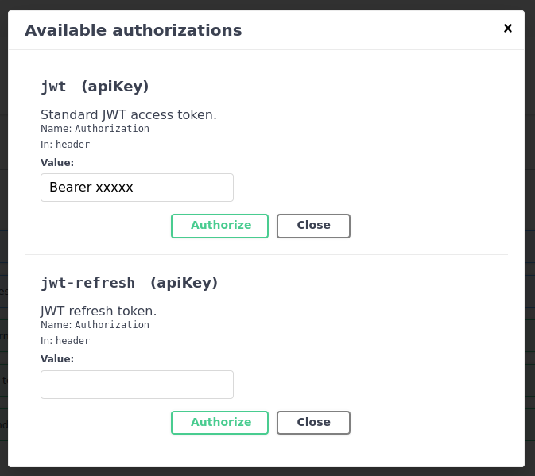

# Tutorial for swagger doc authorization

## 1.

* Expand the `POST /auth/login/` path
* Click on `Try it out`

## 2.

* Click `Execute`

## 3.

* From the result copy the alue of `access_token`.

## 4.

* Scroll to the top and click the `Authorize` button

## 5.

* Paste the access token into the `value` field and prefix it by "`Bearer `"
* Press `Authorize`

